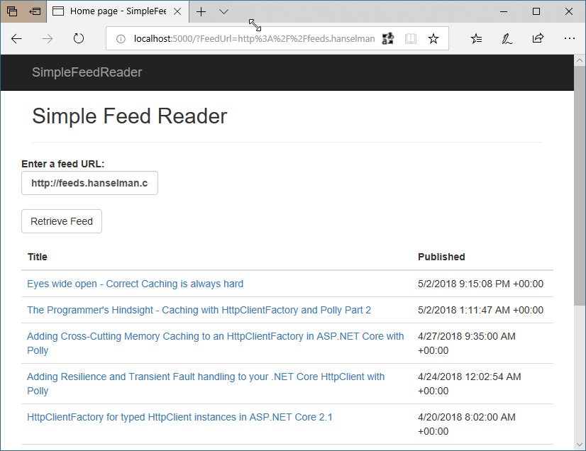
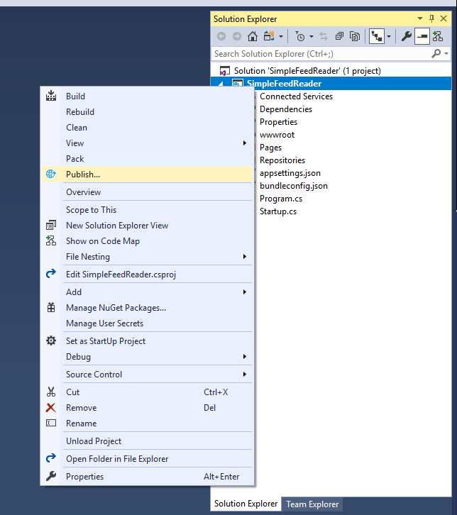
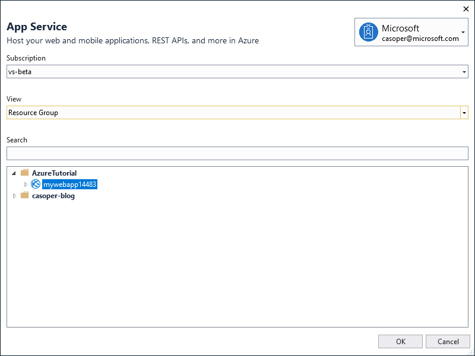
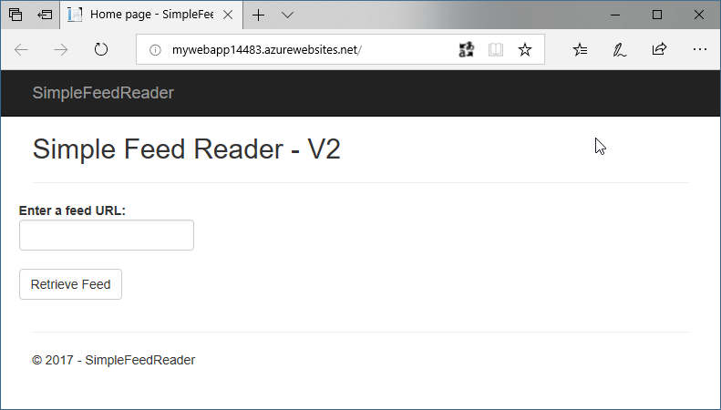
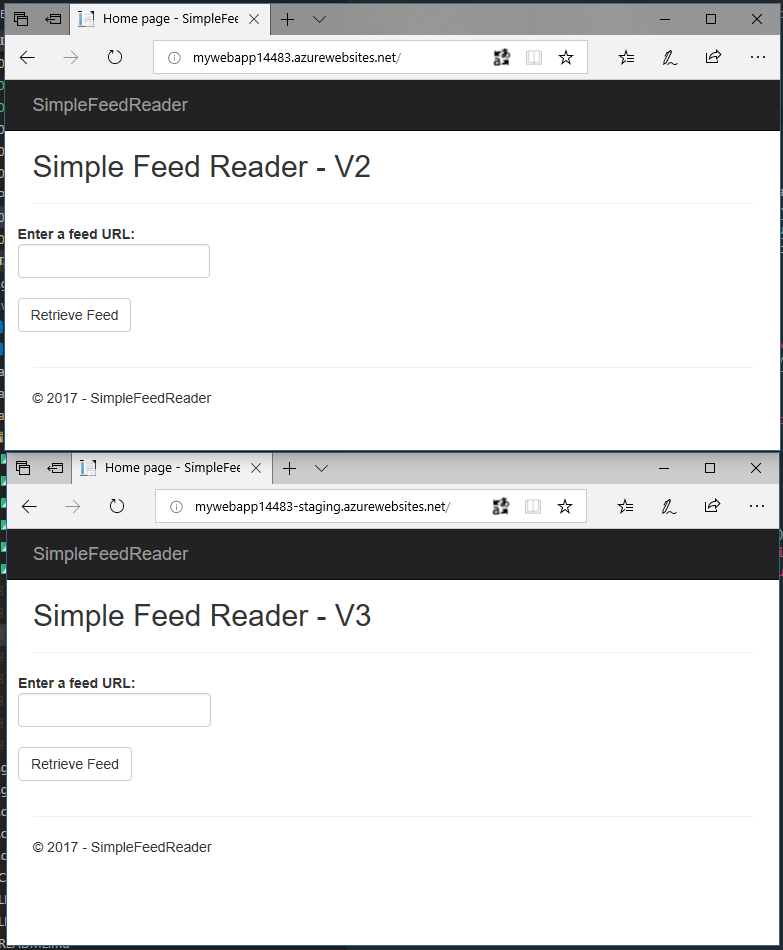
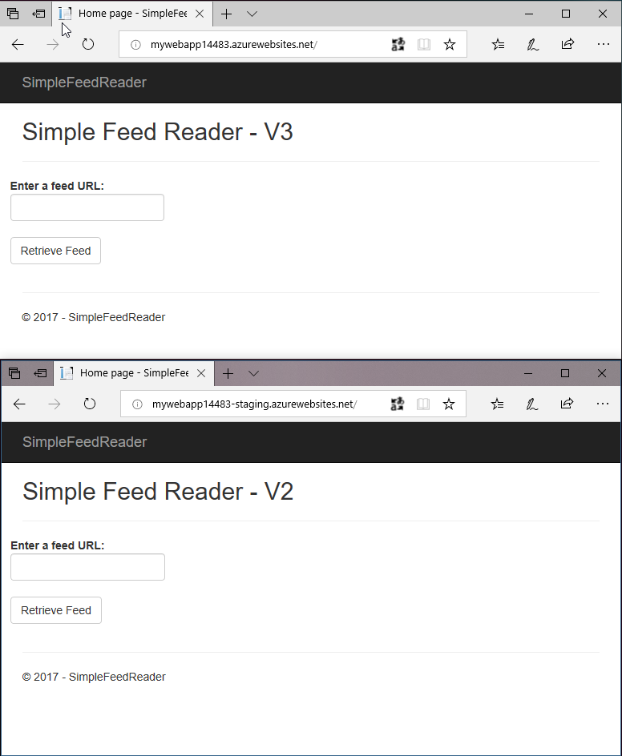

# Deploying an app to App Service

## Overview

[Azure App Service](https://docs.microsoft.com/azure/app-service/) is Azure's web hosting platform. Deploying a web app to Azure App Service can be done multiple ways, either manually or by an automated process. This section of the guide will discuss deployment methods that can be initiated manually or by script.

In this section, you will:

* Download and build the sample app.
* Create an Azure App Service Web App using the Azure Cloud Shell.
* Deploy the sample app to Azure using Git.
* Deploy a change to the app using Visual Studio.
* Add a staging slot to the web app.
* Deploy an update to the staging slot.
* Swap the staging and production slots.

## Download and test the app

The application used in this guide is a pre-built ASP.NET Core application, [Simple Feed Reader](https://github.com/Azure-Samples/simple-feed-reader/). It's a Razor Pages application that uses the `Microsoft.SyndicationFeed.ReaderWriter` API to retrieve an RSS/Atom feed and display the news items in a list.

Feel free to review the code, but it's important to understand that there's nothing special about this app. It's just a simple ASP.NET Core app for illustrative purposes.

From the command line, download the code, build the project, and run it as follows:

1. Clone the code to a folder on your local machine.
    
    ```bash
    git clone https://github.com/Azure-Samples/simple-feed-reader/
    ```
    
2. Change your working folder to the simple-feed-reader folder that was just created.

    ```bash
    cd .\simple-feed-reader\SimpleFeedReader
    ```
     
3. Restore the packages and build the solution.
    
    ```bash
    dotnet build
    ```

4. Run the application.
    
    ```bash
    dotnet run
    ```
    
    

5. Open a browser and navigate to `http://localhost:5000`. The app allows you to type or paste a syndication feed URL and view a list of news items.
    
     
    
6. When you are satisfied the app is working correctly, shut it down by pressing `Ctrl+C` in the command line window.

## Creating the Azure App Service Web App

To deploy the app, you'll need to create an App Service [Web App](https://docs.microsoft.com/azure/app-service/app-service-web-overview), after which you'll deploy from your local maching using Git.

1. Log into the [Azure Cloud Shell](https://shell.azure.com/bash). Note: On first login, Cloud Shell will prompt to create a storage account for configuration files. Accept the defaults or provide a unique name.

2. Use the following script in the Cloud Shell to create the Web App. Make sure to take note of the *Git deployment URL* and the *Web app URL* displayed in the output.

    ```azure-cli
    # These are the credentials that will be used to deploy the web app.
    username=<Replace with desired deployment username>
    password=<Replace with desired deployment password>
    
    # This is the name of your web app. It will be part of the default URL, so it must be unique.
    webappname=mywebapp$RANDOM
    
    # Create a resource group.
    az group create --location centralus --name AzureTutorial
    
    # Create an App Service plan in S1 tier.
    az appservice plan create --name $webappname --resource-group AzureTutorial --sku S1
    
    # Create a web app.
    az webapp create --name $webappname --resource-group AzureTutorial --plan $webappname
    
    # Set the account-level deployment credentials
    az webapp deployment user set --user-name $username --password $password
    
    # Configure local Git and get deployment URL
    echo Git deployment URL: $(az webapp deployment source config-local-git --name $webappname --resource-group AzureTutorial --query url --output tsv)

    # Copy the result of the following command into a browser to see the blank web app.
    echo Web app URL: http://$webappname.azurewebsites.net
    ```    

3. Using a command prompt on your local machine, navigate to the web app's project folder (e.g., `.\simple-feed-reader\SimpleFeedReader`) and execute the following commands:
    
    ```bash
    # Add the remote URL to the local repo - You only need to do this once.
    git remote add azure <Replace with Git deployment URL>
    
    # Push the local master branch to the "azure" remote's master branch
    git push azure master
    ```
    
    You will be prompted for the credentials you created earlier. Observe the output in the command line window and note that Azure builds the ASP.NET Core app remotely.

4. In a browser, navigate to the *Web app URL* and note the app has been built and deployed.  Additional changes can be committed to the local Git repo and pushed to Azure the same way.

> Note: The `webappname` variable used in the Cloud Shell script above is also used in Cloud Shell scripts later in this section. If you disconnect from Cloud Shell and need to start a new session, you can either set the `webappname` variable manually, or you can populate it automatically by looking up the name of the web app with this script:
>    
>    ```azure-cli
>    webappname=$(az webapp list --resource-group AzureTutorial --query [].name --output tsv)
>    ```

## Deployment with Visual Studio

Having deployed the app using command line tools, let's use Visual Studio's integrated tools to deploy an update to the app. Behind the scenes, Visual Studio accomplishes the same thing as the command line tools, but within Visual Studio's familiar UI.

1. Open *SimpleFeedReader.sln* in Visual Studio.
2. In Solution Explorer, open *Pages\Index.cshtml* and change `<h2>Simple Feed Reader</h2>` to `<h2>Simple Feed Reader - V2</h2>`.
3. Press **Ctrl-Shift-B** to build the application.
4. In Solution Explorer, right-click on the project, and select **Publish**.
    
    
5. Visual Studio can create a new App Service resource, but we're going to publish this update over the existing deployment. In the **Pick a publish target** dialog, select **App Service** from the list on the left, and then select **Select Existing**. Click **Publish**.
6. In the **App Service** dialog, ensure that the Microsoft or Organizational account used to create your Azure subscription is displayed in the upper right. If it's not, click the drop down and add it.
7. Ensure the correct Azure **Subscription** is selected. For **View**, select **Resource Group**. Expand the **AzureTutorial** resource group and then select the existing web app. Click **OK**.
    
    

Visual Studio builds and deploys the application to Azure. Browse to the web app URL and note that the change to the `<H2>` is live.



## Deployment slots

Deployment slots are used to stage changes without affecting the running production app. When the staged version of the app has been verified, the production and staging slots can be swapped, promoting the app in staging to production. The following steps create a staging slot, deploy some changes to it, and swap the staging slot with production after verification.

1. Log into the [Azure Cloud Shell](https://shell.azure.com/bash) if not already logged in. 
2. Use the following script to create the staging slot. Make sure to take note of the *Staging Git deployment URL* and the *Staging web app URL* displayed in the output.
    
    ```azure-cli
    # Create a deployment slot with the name "staging".
    az webapp deployment slot create --name $webappname --resource-group AzureTutorial --slot staging
    
    # Configure local Git and get deployment URL
    echo Git deployment URL: $(az webapp deployment source config-local-git --name $webappname --resource-group AzureTutorial --slot staging --query url --output tsv)

    # Copy the result of the following command into a browser to see the staging slot.
    echo Staging web app URL: http://$webappname-staging.azurewebsites.net
    ```

3. In a text editor or Visual Studio, modify *Pages/Index.cshtml* again so that the `<h2>` element reads `<h2>Simple Feed Reader - V2</h2>` and save the file.

4. Commit the file to the local Git repo, using either the **Changes** page in Visual Studio's *Team Explorer* tab, or by entering the following using command line on your local machine:
    
    ```bash
    git commit -a -m "upgraded to V3"
    ```
5. Using the command line on your local machine, change the remote repo to point to the staging deployment URL and push the committed changes:
    
    ```bash
    # Replace the remote URL in the local repo with the staging deployment URL - You only need to do this once.
    git remote set-url azure <Replace with staging Git deployment URL> 
    
    # Push the local master branch to the "azure" remote's master branch
    git push azure master
    ```
    
    Wait while Azure builds and deploys the app.

6. To verify that V3 has been deployed to the staging slot, open two browser windows or tabs. In one, navigate to the original web app URL. In the other, navigate to the staging web app URL. Note that the production URL displays V2 of the app, while the staging URL displays V3.
    
    

7. Swap the staging and production deployment slots. 
    
    ```azure-cli
    # Swap the verified/warmed up staging slot into production.
    az webapp deployment slot swap --name $webappname --resource-group AzureTutorial --slot staging
    ```

8. To verify that the swap occurred, refresh the two browsers. Note that the V2 and V3 versions have swapped.
    
    

## Summary

In this section, you:

* Downloaded and built the sample app.
* Created an Azure App Service Web App using the Azure Cloud Shell.
* Deployed the sample app to Azure using Git.
* Deployed a change to the app using Visual Studio.
* Added a staging slot to the web app.
* Deployed an update to the staging slot.
* Swapped the staging and production slots.

In the next section, you'll learn how to build a continuous integration environment with Azure and Visual Studio Team Services.

## Additional Reading
* [Web Apps overview](https://docs.microsoft.com/azure/app-service/app-service-web-overview)
* [Build a .NET Core and SQL Database web app in Azure App Service](https://docs.microsoft.com/azure/app-service/app-service-web-tutorial-dotnetcore-sqldb)
* [Configure deployment credentials for Azure App Service](https://docs.microsoft.com/azure/app-service/app-service-deployment-credentials)
* [Set up staging environments in Azure App Service](https://docs.microsoft.com/azure/app-service/web-sites-staged-publishing)